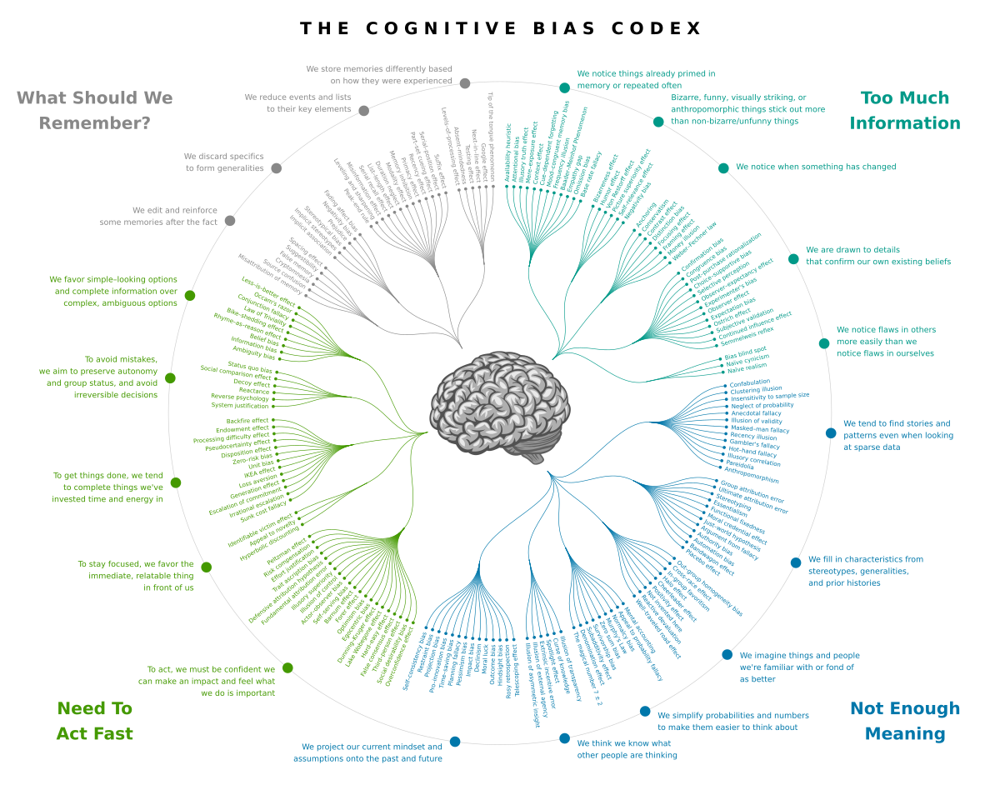

# 1. Introduction

Ensure you have [installed Obsidian](https://help.obsidian.md/install), and have familiarized yourself with the interface. Create a new vault, and copy the contents of this repo to it. That's it!

Start with [Master List](Master%20List.base) - contains a complete list of all the biases, with short descriptions and links to the respective files. `Ctrl+click` on the link to open it in a new tab and navigate!

## 1.1. How Did This All Start?

I realized there was some very useful wisdom here, and i wanted an easily digestible version of the same not hidden behind difficult to access articles/books.

# 2. How is the Repo Structured?

Each bias (represented as a file in the `Biases` directory) contains the following sections:

1. **ELI5**: An `Explain like i am 5 years old` definition of the bias (usually with an example)
2. **Recognizing the Bias**: Expert suggestions to recognize the bias in your surroundings
3. **How Bias Shows Up**: Examples
4. **Quick Test or Checklist**: Simple introspection tool to recognize the extent of the impact of this bias on your decisioning
5. **How to Counteract**: Suggestions to manage this bias

# 3. Sources

The list of all biases was sourced from a combination of the image above and [Wikipedia](https://en.wikipedia.org/wiki/List_of_cognitive_biases). The first draft of this repo was created using AI agents & manual cleanups. Agents were prompted to create one file per bias with the sections described [above](#2.%20How%20is%20the%20Repo%20Structured?).